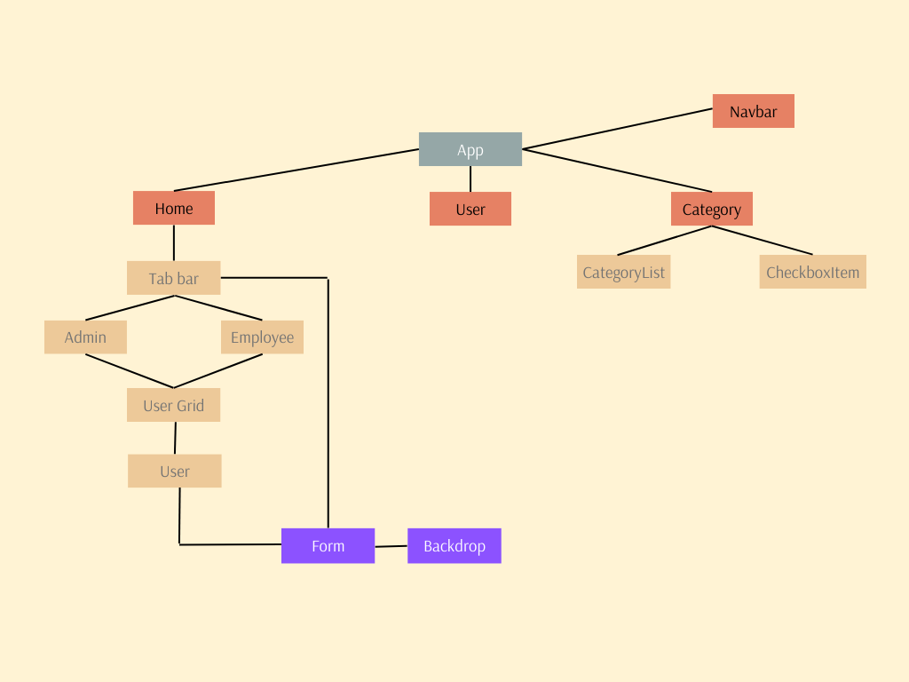

# Custom Tab Component with User Management

# QUICK SORT



QuickSort is a sorting algorithm based on the [Divide and Conquer algorithm](https://www.geeksforgeeks.org/introduction-to-divide-and-conquer-algorithm-data-structure-and-algorithm-tutorials/) that picks an element as a pivot and partitions the given array around the picked pivot by placing the pivot in its correct position in the sorted array.

## Features

- Custom tab component containing lists of administrators and employees.
- First Name, Last Name, and User Type (admin/employee) are the fields in the user adding dialog.
- without calling the API, automatically adds newly additional users to the appropriate list.
- Each row has a Details button that leads to the user details page.
- To edit user info, use the Edit button on the details page.
  separate route with checkboxes and parent name options for presenting particular info.
- validating forms properly with the Formik library.
  CSS and Flexbox responsive layout design.

## Installation

1. Clone the repository:

```md
git clone https://github.com/nasim67reja/users-crud.git
cd your-repo
```

2. Install dependencies:

```
npm install
```

3. Start the development server:

```
npm start
```

4. Open your browser and navigate to `http://localhost:3000` to see the app in action.

## Usage

- Go to the tab component of the app after opening it in your browser.
- Click the "Add User" button to see the user addition modal.
  Enter the necessary user information and choose the user type.
- To add the user, click "Submit". The user's name will be added to the appropriate list.

- To access the user details page, click the "view" button on a row in the user list.
- Click the "Edit" button on the user details page to edit user information using the exact modal.
- Select the data you want to see by navigating the separate route and using the checkboxes.

## Technologies Used

- React
- Formik (for form validation)
- CSS with Flexbox (for layout design)
- Redux Toolkit (for managing state)
- React Router Dom (for routing)
- Axios (for api calling)

## Credits

This project was completed as a coding test for Sadhin Lab. The initial task description and requirements were provided by them.
